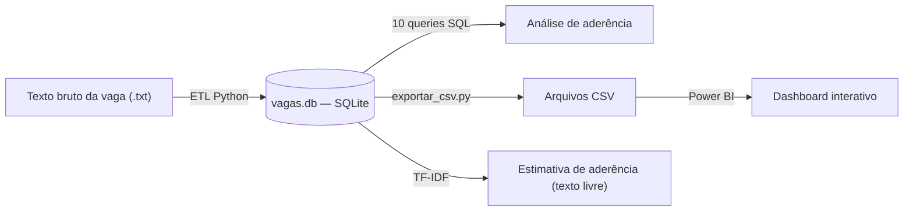

# Portfólio de Dados — Felipe Oliveira de Lima

Estudante de Ciência de Dados (UNIVESP), em transição de carreira de
Qualidade e Segurança dos Alimentos para Dados e BI.

📍 São Paulo, SP · [linkedin.com/in/felipelima1991](https://linkedin.com/in/felipelima1991)

## A ideia por trás desse repositório

Enquanto eu analisava vagas de estágio em Dados e ajustava meu currículo
pra cada uma, percebi que estava acumulando um problema de dados de
verdade: várias vagas, cada uma com requisitos diferentes, e nenhuma forma
estruturada de comparar meu perfil com o que cada uma pedia.

Em vez de resolver isso numa planilha, decidi transformar o próprio
problema em um projeto de portfólio — construindo, fase a fase, o
pipeline completo que uma pessoa de dados usaria: banco de dados → ETL →
dashboard → machine learning.

## Arquitetura do projeto

## As fases

| Fase | O que é | Principais skills |
|---|---|---|
| [1 — Banco de Dados](./fase1-banco-vagas/README.md) | Modelagem relacional das vagas analisadas, com 10 queries SQL | SQL (`JOIN`, `GROUP BY`, `HAVING`), modelagem de dados |
| [2 — ETL em Python](./fase2-etl-python/README.md) | Script que automatiza a inserção de vagas novas no banco | Python, `sqlite3`, Extract/Transform/Load |
| [3 — Dashboard em Power BI](./fase3-dashboard-powerbi/README.md) | Painel interativo replicando a análise de aderência via DAX | Power Query, relacionamentos, DAX, visualização de dados |
| [4 — Estimativa com TF-IDF](./fase4-ml-tfidf/README.md) | Similaridade de texto pra estimar aderência de vagas com vocabulário livre | scikit-learn, TF-IDF, similaridade de cosseno |

Cada pasta tem seu próprio README explicando o problema, as decisões que
tomei e — sempre que apareceu — o bug real que encontrei e como corrigi.
Prefiro documentar os erros do processo a esconder que eles aconteceram.

## Um insight que saiu do projeto

A mesma pergunta — "em qual vaga meu perfil já é mais forte?" — foi
respondida de duas formas independentes (SQL na Fase 1, DAX na Fase 3) e
bateu exatamente:

| Vaga | % Aderência |
|---|---:|
| Estágio em Data & Analytics (Sistemas) | 66,7% |
| Estágio em Analytics | 60,0% |
| Estágio em TI – Foco em Dados | 57,1% |
| Programa de Estágio (2º sem. 2026) | 50,0% |
| Estágio - Tecnologia, Dados & BI | 44,4% |
| Estagiário de Ciência de Dados | 20,0% |

A Fase 4 respondeu a mesma pergunta por um caminho totalmente diferente
(similaridade de texto em vez de contagem de requisitos) e chegou numa
ordem diferente — documentei o porquê no
[README da Fase 4](./fase4-ml-tfidf/README.md), incluindo uma correção de
uma hipótese minha que não se confirmou ao testar.

## Fase planejada (pausada por ora)

- **Fase 5 — Nuvem (AWS)**: subir o banco pra um bucket S3, documentando
  o processo. Comecei essa etapa, mas o cadastro na AWS exigiu um cartão
  de crédito pra validação (débito não foi aceito) — decidi priorizar
  deixar as 4 fases anteriores bem documentadas em vez de travar o
  projeto nisso. Retomo assim que tiver um cartão de crédito disponível.

## Stack

`Python` · `SQL (SQLite)` · `Power BI` · `scikit-learn` · `Git/GitHub`
